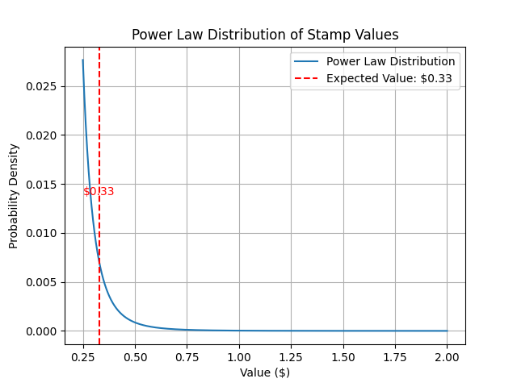
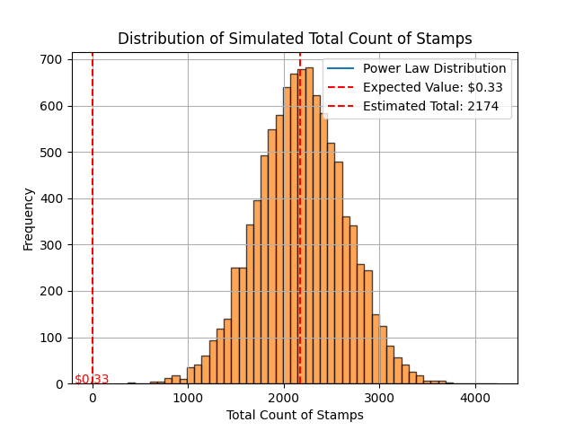

  
## Summary Report: Stamp Collection Valuation
  
### Sample Statistics
  
- **Sample Mean**: 11.32
  - This represents the average number of stamps per sampled page in your collection.
- **Sample Standard Deviation**: 12.66
  - This indicates the variability or spread of the number of stamps per page in your sample.
- **Sample Size**: 28
  - The number of pages sampled out of a total of 192 pages.
  
### Confidence Level Analysis
  
- **Confidence Level**: 97.59%
  - This means that there is a 97.59% probability that the true mean number of stamps per page lies within the margin of error of the sample mean. This high level of confidence suggests that the sample provides a reliable estimate.
  
### Estimation of Total Stamps
  
- **Mean number of stamps per sampled page**: 11.32
  - Reaffirming the average number of stamps per page based on your sample.
- **Estimated total number of stamps**: 2173.71
  - Calculated as the sample mean multiplied by the total number of pages (192). This provides an estimate of the total number of stamps in your collection.
  
### Valuation of Stamps
  
- **Expected value per stamp**: 715.46
  - This is the estimated total value of the stamp collection, calculated as the estimated total number of stamps multiplied by the expected value per stamp.
  
### Interpretation
  
- The **sample mean** provides insight into the distribution of stamps across the sampled pages.
- The **confidence level** of 97.59% indicates that the sample provides a highly reliable estimate.
- The **estimated total number of stamps** (2173.71) and the **estimated total value** ($715.46) give a quantified overview of the collection's size and worth.
  
### Recommendations
  
- **Maintain Current Sampling**: Given the high confidence level, the current sample size appears sufficient for reliable estimates.
- **Periodically Reevaluate**: Regularly reassess the sample and estimates to maintain accuracy as new data becomes available.
  

  
### Distribution of Simulated Total Count of Stamps
  

  